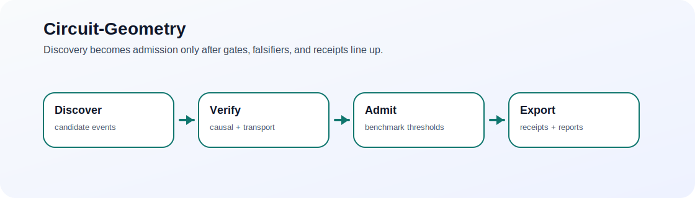

# Circuit-Geometry
> Mechanism assurance for transformer circuits: discover candidates, falsify weak ones, and ship receipts for the mechanisms that survive.

   

Circuit-Geometry exists to move mechanistic interpretability beyond “interesting candidate circuits” and toward benchmarked mechanism decisions with explicit falsifiers, phase gates, and decision receipts.



## 60-second demo
```bash
cargo test --workspace
PYTHONPATH=python python3 examples/python/factual_retrieval_poc.py
```

Produces:
- a workspace under `runs/factual-retrieval/`
- benchmark artifacts such as `admitted_hyperpath_table.json`, `falsifier_sheet.json`, and `transport_diagnostics.json`
- report-ready outputs that can be exported through the Python workspace, API, or UI

## Choose your path
- I want to ship a run: [60-second demo](#60-second-demo) · [Quickstart](#quickstart)
- I want to integrate it: [Core concepts](#core-concepts) · [Product surfaces](#product-surfaces)
- I want to operate it: [Artifacts and evidence](#artifacts-and-evidence) · [Testing and gates](#testing-and-gates)
- I want to contribute: [Roadmap](#roadmap) · [Contributing](#contributing)

## Why this exists
Most circuit-analysis stacks are good at proposing structures and weak at deciding which structures deserve trust. Circuit-Geometry adds admission criteria, benchmark lanes, receipts, and report packs so the end of a run is not “here are some features” but “here is the evidence bundle, here are the falsifiers, and here is the decision.”

## What this is / isn't
✅ Is: a mechanism-assurance framework with deterministic schemas, kernels, benchmark lanes, receipts, API/UI surfaces, and a sidecar runtime boundary  
✅ Is: a Rust evidence plane plus a Python control plane  
❌ Isn't: a one-off notebook stack for ad hoc circuit screenshots  
❌ Isn't: a guarantee that every discovered candidate should be admitted as a mechanism

## Core capabilities
- Discover chart-consistent causal hyperedge events and verify candidate hyperpaths.
- Enforce admission thresholds for intervention effect, synergy, chart stability, transport coherence, and baseline margin.
- Export schemas, bundles, receipts, and report packs that survive CI and release gates.
- Serve runs through a local FastAPI surface and a lightweight browser UI.

## Quickstart
```bash
cargo test --workspace
PYTHONPATH=python python3 -m pytest python/tests -q
PYTHONPATH=python python3 examples/python/factual_retrieval_poc.py
```

CLI surface:
```bash
cargo run -p geoclt-cli -- version
cargo run -p geoclt-cli -- benchmark --lane-id factual_retrieval.v1 --behavior-id factual_retrieval
cargo run -p geoclt-cli -- validate-artifacts --artifact /tmp/geoclt-benchmark-lane.json --schema schemas/benchmark_lane.schema.json
```

Python workspace surface:
```python
from geoclt import Workspace, BenchmarkLaneConfig

ws = Workspace.create("runs/factual-retrieval")
ws.attach_model("gpt2-small")
ws.fit_atlas(profile="factual_retrieval")
ws.fit_transport()
ws.propose_events()
ws.verify_mechanisms()
run = ws.run_benchmark(BenchmarkLaneConfig(lane_id="factual_retrieval.v1", behavior_id="factual_retrieval"))
ws.export_report(run["run_id"])
```

## Core concepts
- Candidate event: the primitive scientific object is a chart-consistent causal hyperedge event, not a dyadic edge.
- Admitted mechanism: a canonical hyperpath that clears causal, synergistic, stability, and transport checks.
- Falsifier: an explicit reason not to trust a candidate, even when it looks plausible.
- Receipt: an auditable record of why a mechanism was admitted, kept provisional, or rejected.

## Product surfaces
- CLI: benchmark lanes, artifact validation, profile runs, and release checks.
- Python SDK: workspace orchestration, adapters, reporting, plotting, and causal analysis.
- API: local FastAPI surface for submitting runs and exporting reports. See [services/api/README.md](services/api/README.md).
- UI: a lightweight mechanism explorer for browsing runs and artifacts. See [services/ui/README.md](services/ui/README.md).
- Sidecar boundary: trace lifecycle, streaming semantics, and artifact delivery contract. See [services/sidecar/README.md](services/sidecar/README.md).

## Artifacts and evidence
- Canonical schemas live under [`schemas/`](schemas/).
- Protocol messages live under [`proto/`](proto/).
- Example outputs and gate evidence live under [`outputs/`](outputs/).
- Report packs live under [`docs/reports/`](docs/reports/).
- Architecture docs start in [`docs/architecture/`](docs/architecture/).

## Testing and gates
- Rust CI: `cargo build --workspace`, `cargo test --workspace`, `cargo clippy --workspace --all-targets -- -D warnings`
- Python CI: `PYTHONPATH=python pytest python/tests -q`, `ruff check python`, `mypy python/geoclt`
- Release and phase gates:
  - `bash scripts/validate_artifacts.sh`
  - `bash scripts/run_phase4a_gate.sh`
  - `bash scripts/run_phase4a_nightly_models.sh`
  - `bash scripts/run_phase4b_gate.sh`
  - `bash scripts/run_release_candidate.sh`

## Status
- Phase 0/1 through Phase 4 report packs exist in-repo.
- The runtime surfaces are real enough to benchmark and export, but the product still reads as an active research system rather than a frozen platform.
- Mechanism assurance is the headline feature; broad model coverage is still expanding.

## Roadmap
- Add more benchmark lanes beyond factual retrieval and current real-world pilot lanes.
- Strengthen sidecar-first runtime flows and release-evidence packaging.
- Expand report automation, model adapters, and longitudinal drift monitoring.

## Contributing
Use small, reviewable changes and keep the Rust/Python split clean:
```bash
cargo test --workspace
PYTHONPATH=python pytest python/tests -q
ruff check python
mypy python/geoclt
```
Start with the repo conventions in [docs/architecture/repo-conventions.md](docs/architecture/repo-conventions.md) and the ADRs in [docs/adr/](docs/adr/).

## License
[MIT](LICENSE)
