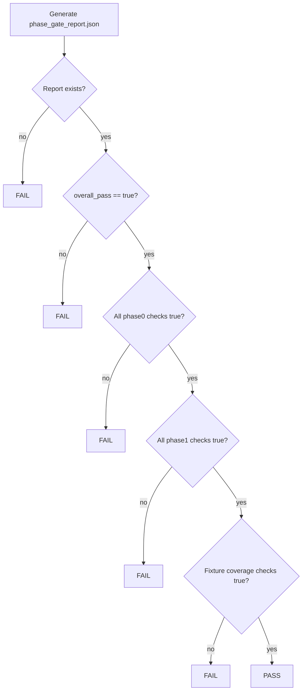

# Phase 0/1 Logic Specifications

## 1. Top-Level Gate Logic

## 2. Truth Table (Gate Core)
Let:
- `O` = `overall_pass`
- `P0` = all required Phase 0 booleans true
- `P1` = all required Phase 1 booleans true
- `F` = fixture coverage checks true

`PASS = O AND P0 AND P1 AND F`

| O | P0 | P1 | F | Result |
|---|----|----|---|--------|
| 0 | *  | *  | * | FAIL |
| 1 | 0  | *  | * | FAIL |
| 1 | 1  | 0  | * | FAIL |
| 1 | 1  | 1  | 0 | FAIL |
| 1 | 1  | 1  | 1 | PASS |

## 3. Boundary and Edge Conditions
- Minimum fixture cardinality boundary: `<3` fixtures is immediate fail.
- Positive fixture boundary: missing `positive_default` is fail.
- Negative fixture boundary: no negative fixtures is fail.
- Determinism boundary: mismatched rerun bundle hashes is fail.
- Artifact boundary: artifact count must be exactly five for Phase 1 run.

## 4. Error Handling
- Any missing field/path results in non-zero exit from assertion script.
- Assertion error output includes failing key for quick triage.
- Schema/validation issues surface through Phase 1 `artifacts_validate` check.

## 5. Timing / Clock Domain Notes
- No hardware clock domain behavior applies.
- Time-dependent run IDs are excluded from scientific bundle hash checks.
- Determinism is checked by hash equality across repeated identical signatures.
