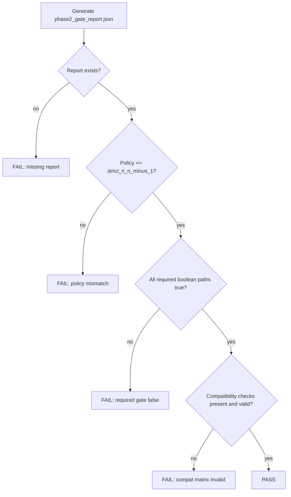

# Phase 2 Logic Specifications

## 1. Assertion Logic Flow

## 2. Truth Table (Top-level Gate)
Let:
- `P` = policy locked
- `R` = required booleans all true
- `C` = compatibility rows all valid

`PASS = P AND R AND C`

| P | R | C | Result |
|---|---|---|--------|
| 0 | * | * | FAIL |
| 1 | 0 | * | FAIL |
| 1 | 1 | 0 | FAIL |
| 1 | 1 | 1 | PASS |

## 3. Conditional Assertions (Duplicate Chunk Rule)

| Condition | Expected |
|---|---|
| Same trace+key, identical payload | `duplicate_noop_ok = true` |
| Same trace+key, different payload | `conflict_hard_fail = true` |

## 4. Boundary Conditions
- Schema version boundary (compatibility):
  - `N` accepted
  - `N-1` accepted
  - `N-2` rejected
- Artifact bundle version edge case:
  - `current_version=1` treats `N-1` as vacuously allowed in gate report semantics.
- Determinism boundary:
  - same input signature rerun must preserve bundle hash.

## 5. Edge Case Analysis
- Missing gate file: immediate hard-fail.
- Missing nested key path in report: raises key-path failure and hard-fails.
- Empty compatibility matrix: hard-fail.
- Duplicate chunk conflict: trace fails by design; asserted in both Rust and Python tests.
- Non-git execution context: `git_commit` may be `unknown`; this is informational, not a gate blocker.

## 6. Signal Dependencies
Primary signals in `phase2_gate_report.json`:
- `real_sidecar_roundtrip`
- `real_adapter_conformance`
- `passive_non_perturbation.*`
- `canonical_serialization.*`
- `determinism.*`
- `duplicate_chunk_policy.*`
- `compatibility_matrix.*`

Dependency structure:
- `overall_pass` depends on all above logical inputs.
- `assert_phase2_gate_report.py` validates both derived (`overall_pass`) and primitive signals.

## 7. Clock / Timing Domain Relationships
- No hardware clock domain crossings exist.
- Time-sensitive fields (`created_at`) are deterministic in gate-path payloads where needed for reproducibility.
- Runtime measurements are wall-clock snapshots; not pass/fail criteria.

## 8. Reset Behavior
- Trace lifecycle reset semantics:
  - `start_trace`: initializes trace state
  - `abort_trace`: marks trace aborted and removes from active domain
  - `end_trace`: finalizes immutable bundle and exits active set

## 9. Assertion Enabling/Disabling Conditions
- Enabled whenever `scripts/assert_phase2_gate_report.py` is executed.
- No runtime feature flags disable these assertions in CI path.
- Gate assertions can only be bypassed by not invoking runner scripts (not done in CI pipeline).

## 10. Formal Property Specifications (Operational Form)
- Property `P1` (Deterministic Hash):
  - For fixed input trace payload, `bundle_hash(t1) == bundle_hash(t2)` across reruns.
- Property `P2` (Idempotent Duplicate):
  - Same key+payload duplicate chunk does not alter correctness outcome.
- Property `P3` (Conflict Safety):
  - Same key+different payload must produce failure.
- Property `P4` (Compatibility Contract):
  - `N` and `N-1` accepted; `N-2` rejected for all registered artifact classes.

## 11. Error Handling Mechanisms
- Gate scripts return non-zero on assertion failures.
- Validation errors print explicit failing path or artifact class.
- Sidecar runtime returns explicit conflict errors for chunk-id collisions with mismatched payloads.
